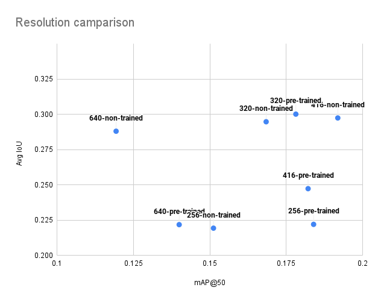

# FabVis-Models

Clone the repository,

```sh
git clone https://github.com/IntellisenseLab/FabVis-Models.git
```

Download pretrained weight files from [here](https://drive.google.com/drive/folders/1JVNd73yBYyc2zmSpT_0xdXGlFTm3Aj2i?usp=sharing) or trained weight files from [here](https://drive.google.com/drive/folders/1T1TOtBPdqAKvcSKPr4Ck1FthdLoPeb5Y?usp=sharing) and extract them and move the each folder into the repo folder.


<br>

# Yolov4 Model Comparison

## Comparison of Resolution 

Evaluating the effect of resolution on the performance of the model

| Model | Reso lution | Batch | Sub divisions | Pre trained | Precision | Recall | F1 score | mAP @0.5 | Avg IoU | Output |
| ----- | ----------- | ----- | ------------- |------------ |---------- |------- |--------- | -------- | ------- | ------ |
| Tiny  | 640 | 64 | 16 | Yes | 0.33 | 0.07 | 0.12 | 0.1400 | 0.2219 | [terminal](trainOutput/yolov4-tiny-pretrained-colab-640.png) |
| Tiny  | 416 | 64 | 16 | Yes | 0.36 | 0.10 | 0.16 | 0.1821 | 0.2474 | [terminal](trainOutput/yolov4-tiny-pretrained-colab-416.png) |
| Tiny  | 320 | 64 | 16 | Yes | 0.45 | 0.14 | 0.22 | 0.1781 | 0.3002 | [terminal](trainOutput/yolov4-tiny-pretrained-colab-320.png) |
| Tiny  | 256 | 64 | 16 | Yes | 0.33 | 0.09 | 0.15 | 0.1839 | 0.2221 | [terminal](trainOutput/yolov4-tiny-pretrained-colab-256.png) |
| Tiny  | 640 | 64 | 16 | No  | 0.43 | 0.10 | 0.17 | 0.1194 | 0.2881 | [terminal](trainOutput/yolov4-tiny-no-pretrained-colab-640.png) |
| Tiny  | 416 | 64 | 16 | No  | 0.45 | 0.10 | 0.16 | 0.1918 | 0.2978 | [terminal](trainOutput/yolov4-tiny-no-pretrained-colab-416.png) |
| Tiny  | 320 | 64 | 16 | No  | 0.43 | 0.12 | 0.18 | 0.1684 | 0.2948 | [terminal](trainOutput/yolov4-tiny-no-pretrained-colab-320.png) |
| Tiny  | 256 | 64 | 16 | No  | 0.33 | 0.10 | 0.15 | 0.1512 | 0.2194 | [terminal](trainOutput/yolov4-tiny-no-pretrained-colab-256.png) |




## Comparison of Models (Trained on Google Colab with nvidia P100 and V100 and rtx2080)

All the values range between 0 - 1

| Model | Reso lution | Batch | Sub divisions | Pre trained | Precision | Recall | F1 score | mAP @0.5 | Avg IoU | Output |
| ----- | ----------- | ----- | ------------- |------------ |---------- |------- |--------- | -------- | ------- | ------ |
| yolov4-tiny   | 416 | 16 | 8 | Yes | 0.21 | 0.08 | 0.11 | 0.1080 | 0.1422 | [terminal](trainOutput/yolov4-tiny-pretrained-416.png) |
| yolov4        | 416 | 16 | 8 | Yes | 0.62 | 0.33 | 0.43 | 0.1846 | 0.4690 | [terminal](trainOutput/yolov4-pretrained-416.png) |
| yolov4x-mish  | 416 | 16 | 8 | Yes | 0.65 | 0.34 | 0.44 | 0.2312 | 0.4881 | [terminal](trainOutput/yolov4x-mish-pretrained-416.png) |


<br>

# Model Train Commands

Following commands will enable the training of models in coorindation of [Preprocess system](https://github.com/IntellisenseLab/FabVis-RD-Preprocess)

<br>

## Yolov4-Tiny

```sh
./darknet detector train ../config/obj.data ../FabVis-Models/config/yolov4-tiny.cfg ../FabVis-Models/preTrainedWeights/yolov4-tiny.conv.29 -dont_show -mjpeg_port 8090 -map
```

## Yolov4

```sh
./darknet detector train ../config/obj.data ../FabVis-Models/config/yolov4.cfg ../FabVis-Models/preTrainedWeights/yolov4.conv.137 -dont_show -mjpeg_port 8090 -map
```

## Yolov4x-mish

```sh
./darknet detector train ../config/obj.data ../FabVis-Models/config/yolov4x-mish.cfg ../FabVis-Models/preTrainedWeights/yolov4x-mish.conv.166 -dont_show -mjpeg_port 8090 -map
```

## Yolov4-csp-swish

```sh
./darknet detector train ../config/obj.data ../FabVis-Models/config/yolov4-csp-swish.cfg ../FabVis-Models/preTrainedWeights/yolov4-csp-swish.conv.164 -dont_show -mjpeg_port 8090 -map
```

## Yolov4-csp-x-swish

```sh
./darknet detector train ../config/obj.data ../FabVis-Models/config/yolov4-csp-x-swish.cfg ../FabVis-Models/preTrainedWeights/yolov4-csp-x-swish.conv.192 -dont_show -mjpeg_port 8090 -map
```

## Yolov4-csp

```sh
./darknet detector train ../config/obj.data ../FabVis-Models/config/yolov4-csp.cfg ../FabVis-Models/preTrainedWeights/yolov4-csp.conv.142 -dont_show -mjpeg_port 8090 -map
```

## Yolov4-p5

```sh
./darknet detector train ../config/obj.data ../FabVis-Models/config/yolov4-p5.cfg ../FabVis-Models/preTrainedWeights/yolov4-p5.conv.232 -dont_show -mjpeg_port 8090 -map
```

## Yolov4-p6

```sh
./darknet detector train ../config/obj.data ../FabVis-Models/config/yolov4-p6.cfg ../FabVis-Models/preTrainedWeights/yolov4-p6.conv.289 -dont_show -mjpeg_port 8090 -map
```

## Yolov4-p7-mish

```sh
./darknet detector train ../config/obj.data ../FabVis-Models/config/cspx-p7-mish.cfg ../FabVis-Models/preTrainedWeights/cspx-p7-mish_hp.344.conv -dont_show -mjpeg_port 8090 -map
```
