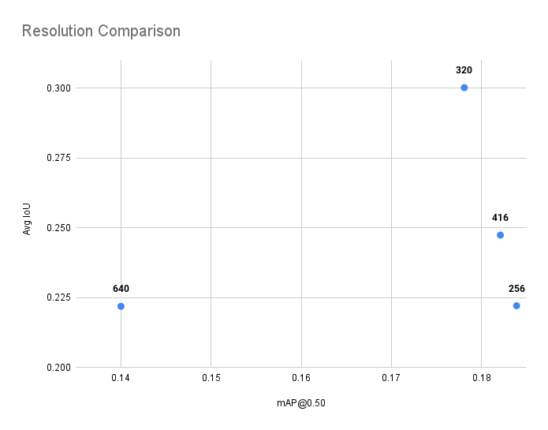
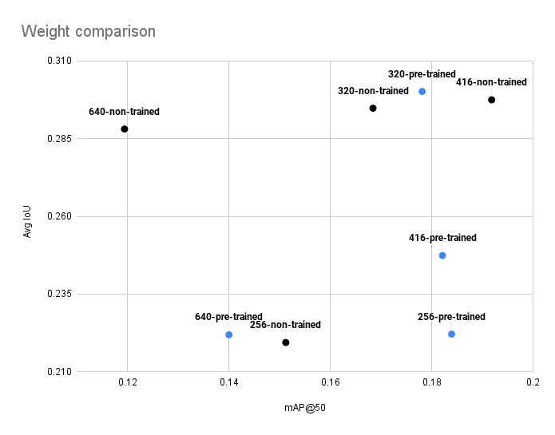
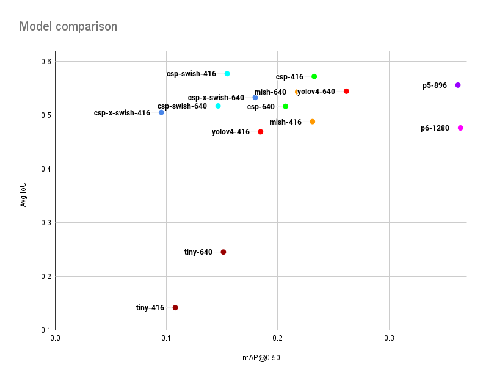
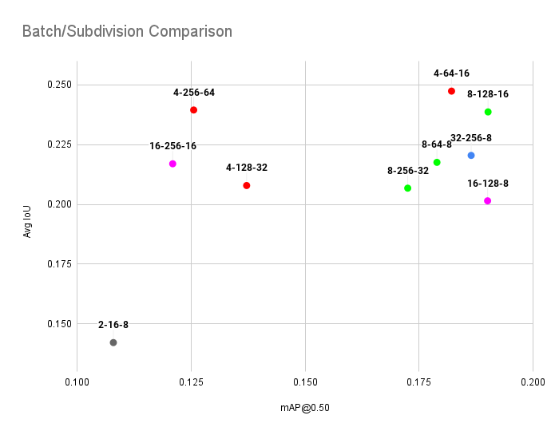

# FabVis-Models

Clone the repository,

```sh
git clone https://github.com/IntellisenseLab/FabVis-Models.git
```

Download pretrained weight files from [here](https://drive.google.com/drive/folders/1JVNd73yBYyc2zmSpT_0xdXGlFTm3Aj2i?usp=sharing) or trained weight files from [here](https://drive.google.com/drive/folders/1T1TOtBPdqAKvcSKPr4Ck1FthdLoPeb5Y?usp=sharing) and extract them and move the each folder into the repo folder.


<br>

# Yolov4 Model Comparison

## Comparison of Resolution 

Evaluating the effect of resolution on the performance of the model

| Model | Reso lution | Batch | Sub divisions | Pre trained | Precision | Recall | F1 score | mAP @0.5 | Avg IoU | Output |
| ----- | ----------- | ----- | ------------- |------------ |---------- |------- |--------- | -------- | ------- | ------ |
| Tiny  | 640 | 64 | 16 | Yes | 0.33 | 0.07 | 0.12 | 0.1400 | 0.2219 | [terminal](trainOutput/yolov4-tiny-pretrained-colab-640.png) |
| Tiny  | 416 | 64 | 16 | Yes | 0.36 | 0.10 | 0.16 | 0.1821 | 0.2474 | [terminal](trainOutput/yolov4-tiny-pretrained-colab-416.png) |
| Tiny  | 320 | 64 | 16 | Yes | 0.45 | 0.14 | 0.22 | 0.1781 | 0.3002 | [terminal](trainOutput/yolov4-tiny-pretrained-colab-320.png) |
| Tiny  | 256 | 64 | 16 | Yes | 0.33 | 0.09 | 0.15 | 0.1839 | 0.2221 | [terminal](trainOutput/yolov4-tiny-pretrained-colab-256.png) |



<br>

## Comparison of use of Weights 

Evaluating the effect of resolution on the performance of the model

| Model | Reso lution | Batch | Sub divisions | Pre trained | Precision | Recall | F1 score | mAP @0.5 | Avg IoU | Output |
| ----- | ----------- | ----- | ------------- |------------ |---------- |------- |--------- | -------- | ------- | ------ |
| Tiny  | 640 | 64 | 16 | Yes | 0.33 | 0.07 | 0.12 | 0.1400 | 0.2219 | [terminal](trainOutput/yolov4-tiny-pretrained-colab-640.png) |
| Tiny  | 640 | 64 | 16 | No  | 0.43 | 0.10 | 0.17 | 0.1194 | 0.2881 | [terminal](trainOutput/yolov4-tiny-no-pretrained-colab-640.png) |
| Tiny  | 416 | 64 | 16 | Yes | 0.36 | 0.10 | 0.16 | 0.1821 | 0.2474 | [terminal](trainOutput/yolov4-tiny-pretrained-colab-416.png) |
| Tiny  | 416 | 64 | 16 | No  | 0.45 | 0.10 | 0.16 | 0.1918 | 0.2978 | [terminal](trainOutput/yolov4-tiny-no-pretrained-colab-416.png) |
| Tiny  | 320 | 64 | 16 | Yes | 0.45 | 0.14 | 0.22 | 0.1781 | 0.3002 | [terminal](trainOutput/yolov4-tiny-pretrained-colab-320.png) |
| Tiny  | 320 | 64 | 16 | No  | 0.43 | 0.12 | 0.18 | 0.1684 | 0.2948 | [terminal](trainOutput/yolov4-tiny-no-pretrained-colab-320.png) |
| Tiny  | 256 | 64 | 16 | Yes | 0.33 | 0.09 | 0.15 | 0.1839 | 0.2221 | [terminal](trainOutput/yolov4-tiny-pretrained-colab-256.png) |
| Tiny  | 256 | 64 | 16 | No  | 0.33 | 0.10 | 0.15 | 0.1512 | 0.2194 | [terminal](trainOutput/yolov4-tiny-no-pretrained-colab-256.png) |



<br>

## Comparison of Models

All the values range between 0 - 1

| Model | Reso lution | Batch | Sub divisions | Pre trained | Precision | Recall | F1 score | mAP @0.5 | Avg IoU | Output |
| ----- | ----------- | ----- | ------------- |------------ |---------- |------- |--------- | -------- | ------- | ------ |
| yolov4-tiny        | 416 | 16 | 8 | Yes | 0.21 | 0.08 | 0.11 | 0.1080 | 0.1422 | [terminal](trainOutput/yolov4-tiny-pretrained-416.png) |
| yolov4-tiny        | 640 | 16 | 8 | Yes | 0.35 | 0.09 | 0.14 | 0.1512 | 0.2455 | [terminal](trainOutput/yolov4-tiny-pretrained-640.png) |
| yolov4             | 416 | 16 | 8 | Yes | 0.62 | 0.33 | 0.43 | 0.1846 | 0.4690 | [terminal](trainOutput/yolov4-pretrained-416.png) |
| yolov4             | 640 | 16 | 8 | Yes | 0.73 | 0.44 | 0.55 | 0.2617 | 0.5446 | [terminal](trainOutput/yolov4-pretrained-640.png) |
| yolov4x-mish       | 416 | 16 | 8 | Yes | 0.65 | 0.34 | 0.44 | 0.2312 | 0.4881 | [terminal](trainOutput/yolov4x-mish-pretrained-416.png) |
| yolov4x-mish       | 640 | 16 | 8 | Yes | 0.72 | 0.41 | 0.53 | 0.2178 | 0.5433 | [terminal](trainOutput/yolov4x-mish-pretrained-640.png) |
| yolov4-csp         | 416 | 16 | 8 | Yes | 0.77 | 0.36 | 0.49 | 0.2328 | 0.5720 | [terminal](trainOutput/yolov4-csp-pretrained-416.png) |
| yolov4-csp         | 640 | 16 | 8 | Yes | 0.69 | 0.44 | 0.53 | 0.2070 | 0.5164 | [terminal](trainOutput/yolov4-csp-pretrained-640.png) |
| yolov4-csp-swish   | 416 | 16 | 8 | Yes | 0.68 | 0.33 | 0.44 | 0.1546 | 0.5771 | [terminal](trainOutput/yolov4-csp-swish-pretrained-416.png) |
| yolov4-csp-swish   | 640 | 16 | 8 | Yes | 0.68 | 0.45 | 0.54 | 0.1464 | 0.5052 | [terminal](trainOutput/yolov4-csp-swish-pretrained-640.png) |
| yolov4-csp-x-swish | 416 | 16 | 8 | Yes | 0.68 | 0.33 | 0.45 | 0.0955 | 0.5172 | [terminal](trainOutput/yolov4-csp-x-swish-pretrained-416.png) |
| yolov4-csp-x-swish | 640 | 16 | 8 | Yes | 0.71 | 0.43 | 0.54 | 0.1798 | 0.5329 | [terminal](trainOutput/yolov4-csp-x-swish-pretrained-640.png) |
| yolov4-p5          | 896 | 16 | 8 | Yes | 0.68 | 0.41 | 0.51 | 0.3619 | 0.5559 | [terminal](trainOutput/yolov4-p5-pretrained-896.png) |
| yolov4-p6          |1280 | 16 |16 | Yes | 0.60 | 0.43 | 0.50 | 0.3642 | 0.4763 | [terminal](trainOutput/yolov4-p6-pretrained-1280.png) |



<br>

## Comparison of Batch size and subdivision size

All the values range between 0 - 1
Used Model is yolov4-tiny, and resolution is 416x416

| Minibatch | Batch | Sub divisions | Pre trained | Precision | Recall | F1 score | mAP @0.5 | Avg IoU | Output |
| ----- | --- | -- | --- |----- | ---- |----- |------- | ------ | --------------------------------------------- |
|   2   |  16 | 8  | Yes | 0.21 | 0.08 | 0.11 | 0.1080 | 0.1422 | [terminal](trainOutput/yolov4-tiny-pretrained-16-8.png) |
|   4   |  64 | 16 | Yes | 0.36 | 0.10 | 0.16 | 0.1821 | 0.2474 | [terminal](trainOutput/yolov4-tiny-pretrained-64-16.png) |
|   8   |  64 | 8  | Yes | 0.34 | 0.11 | 0.16 | 0.1789 | 0.2176 | [terminal](trainOutput/yolov4-tiny-pretrained-64-8.png) |
|   4   | 128 | 32 | Yes | 0.30 | 0.10 | 0.15 | 0.1372 | 0.2079 | [terminal](trainOutput/yolov4-tiny-pretrained-128-32.png) |
|   8   | 128 | 16 | Yes | 0.36 | 0.11 | 0.17 | 0.1901 | 0.2387 | [terminal](trainOutput/yolov4-tiny-pretrained-128-16.png) |
|   16  | 128 | 8  | Yes | 0.29 | 0.09 | 0.14 | 0.1900 | 0.2015 | [terminal](trainOutput/yolov4-tiny-pretrained-128-8.png) |
|   4   | 256 | 64 | Yes | 0.35 | 0.12 | 0.18 | 0.1256 | 0.2395 | [terminal](trainOutput/yolov4-tiny-pretrained-256-64.png) |
|   8   | 256 | 32 | Yes | 0.30 | 0.11 | 0.16 | 0.1725 | 0.2068 | [terminal](trainOutput/yolov4-tiny-pretrained-256-32.png) |
|   16  | 256 | 16 | Yes | 0.31 | 0.09 | 0.14 | 0.1210 | 0.2170 | [terminal](trainOutput/yolov4-tiny-pretrained-256-16.png) |
|   32  | 256 | 8  | Yes | 0.32 | 0.10 | 0.16 | 0.1864 | 0.2205 | [terminal](trainOutput/yolov4-tiny-pretrained-256-8.png) |




<br>

## Comparison of Final Model


<br>

## Comparison of resource utilization of the largest models

### Idle utilization


### yolov4-p5 utilization

- RAM Memory usage - ~1.8 GB
- GPU Memory usage - ~3.5 GB
- CPU count (used) - 1


### yolov4-p6 utilization

- RAM Memory usage - ~2.2 GB
- GPU Memory usage - ~6.1 GB
- CPU count (used) - 1


<br>


# Model Train Commands

Following commands will enable the training of models in coorindation of [Preprocess system](https://github.com/IntellisenseLab/FabVis-RD-Preprocess)

<br>

## Yolov4-Tiny

```sh
./darknet detector train ../config/obj.data ../FabVis-Models/config/yolov4-tiny.cfg ../FabVis-Models/preTrainedWeights/yolov4-tiny.conv.29 -dont_show -mjpeg_port 8090 -map
```

## Yolov4

```sh
./darknet detector train ../config/obj.data ../FabVis-Models/config/yolov4.cfg ../FabVis-Models/preTrainedWeights/yolov4.conv.137 -dont_show -mjpeg_port 8090 -map
```

## Yolov4x-mish

```sh
./darknet detector train ../config/obj.data ../FabVis-Models/config/yolov4x-mish.cfg ../FabVis-Models/preTrainedWeights/yolov4x-mish.conv.166 -dont_show -mjpeg_port 8090 -map
```

## Yolov4-csp-swish

```sh
./darknet detector train ../config/obj.data ../FabVis-Models/config/yolov4-csp-swish.cfg ../FabVis-Models/preTrainedWeights/yolov4-csp-swish.conv.164 -dont_show -mjpeg_port 8090 -map
```

## Yolov4-csp-x-swish

```sh
./darknet detector train ../config/obj.data ../FabVis-Models/config/yolov4-csp-x-swish.cfg ../FabVis-Models/preTrainedWeights/yolov4-csp-x-swish.conv.192 -dont_show -mjpeg_port 8090 -map
```

## Yolov4-csp

```sh
./darknet detector train ../config/obj.data ../FabVis-Models/config/yolov4-csp.cfg ../FabVis-Models/preTrainedWeights/yolov4-csp.conv.142 -dont_show -mjpeg_port 8090 -map
```

## Yolov4-p5

```sh
./darknet detector train ../config/obj.data ../FabVis-Models/config/yolov4-p5.cfg ../FabVis-Models/preTrainedWeights/yolov4-p5.conv.232 -dont_show -mjpeg_port 8090 -map
```

## Yolov4-p6

```sh
./darknet detector train ../config/obj.data ../FabVis-Models/config/yolov4-p6.cfg ../FabVis-Models/preTrainedWeights/yolov4-p6.conv.289 -dont_show -mjpeg_port 8090 -map
```
